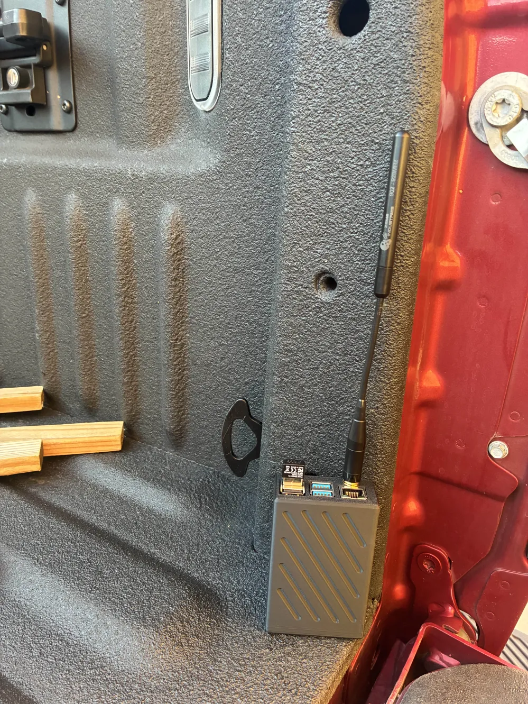

# Get Started Enclosure

This directory captures the baseline enclosure that ships with Get Started kits. It houses a Raspberry Pi 4, HaLow radio, and optional UPS hardware inside a snap-fit shell that prints on a 220 mm bed.

## Overview

- Three variants share the same IO layout but differ in battery accommodation: Pisugar UPS, Waveshare UPS D, or a no-UPS shell.
- Lid uses a flexible latch that survives repeated openings when printed in ABS/ASA.
- External buttons are split into a separate part to keep tolerances tight and maintain layer adhesion.

## Reference Photo

> Add additional perspective photos to `pics/` so other builders can see connector routing and antenna placement.

## Variant Files

| Variant | Main Body / Hatch STL | UPS Support | SMA to U.FL Pigtails |
|---------|-----------------------|-------------|----------------------|
| Pisugar UPS | `open manet enclosure pisugar ups main body.stl`, `open manet enclosure pisugar ups hatch.stl`, `open manet enclosure pisugar ups external buttons.stl` | Pisugar 3 power platform | 2 × 6" pigtails |
| Waveshare UPS D | `open manet enclosure WAVESHARE UPS D main body.stl`, `open manet enclosure WAVESHARE UPS D hatch.stl` | Waveshare UPS D + 18650 sled | 2 × 6" pigtails |
| No UPS | `open manet enclosure no ups main body.stl`, `open manet enclosure no ups hatch.stl` | None – direct external power | 1 × 6" pigtail |

All CAD source files (`*.f3z`) for each variant are included for remixing. Keep the SMA jack spacing consistent so the hatch remains reusable between versions.

## Printing Guidance

- Strongly prefer ABS or ASA for every structural part; the enclosure runs warm and the snap joints need ductility.
- Orient the main body with the front face down so the internal standoffs print cleanly and support the Pi with minimal cleanup.
- Print the external button part flat on its back so perimeters align with the travel direction—this maximizes layer adhesion across the narrow bridge between buttons.
- Use 0.2 mm layers, 4 perimeters, and ≥30% infill for the main body; lids can drop to 3 perimeters.

## Recommended Parts

| Item | Optional | Notes |
|------|----------|-------|
| Wio WM6180 Wi-Fi HaLow mini PCIe Module | No | Primary radio |
| WM1302 Pi Hat | No | Mate the HaLow card to the Pi |
| External Antenna 868/915 MHz 2 dBi SMA Foldable | No | Two ports for UPS builds, single port for no-UPS |
| SMA to U.FL cable assembly, 6" (150 mm) | No | Qty depends on variant above |
| Raspberry Pi 4 Model B (1 GB or greater) | No | Core compute |
| 21700 Rechargeable Batteries | Yes | Only for UPS builds that support them |
| Waveshare UPS B/D board | Yes | Use with corresponding enclosure files |
| Pisugar UPS 3 | Yes | Use with Pisugar variant |
| Panda PAU06 USB Wi-Fi Adapter | Yes | Optional client radio |
| USB GPS Receiver (u-blox based) | Yes | Optional timing source |

