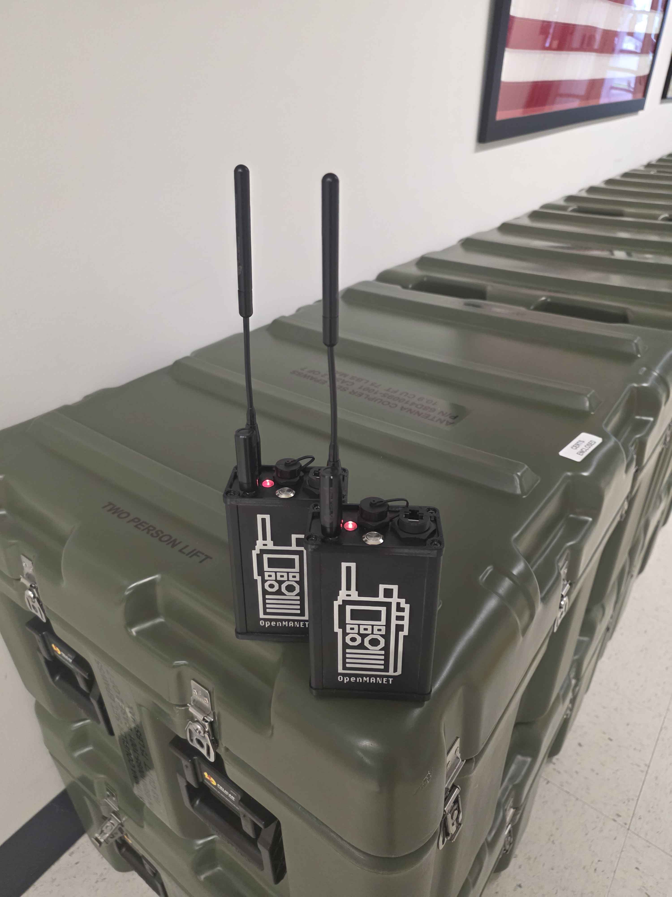
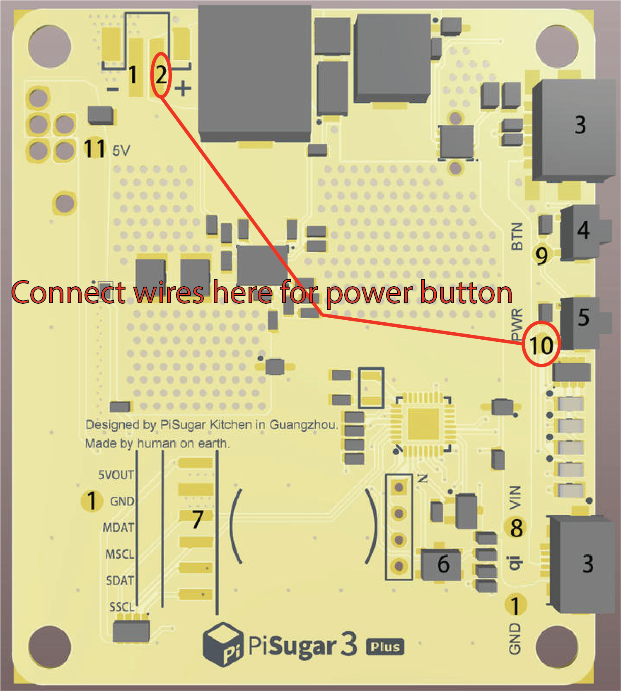

# Hammond Enclosure

OpenMANET enclosure for a Raspberry Pi 4B that uses a Hammond 1457K1201BK case with a printed cap and carrier tray. An inline connector between the power switch and the PiSugar can be added to make disassembly and reassembly easier.

## Photos

## Bill of Materials

| # | Part | Qty | Part Number | Link | Vendor/Notes |
|---|------|-----|-------------|------|--------------|
| 1 | Enclosure | 1 | 1457K1201BK | https://www.hawkusa.com/manufacturers/hammond-mfg/enclosures/1457k1201bk | Hammond |
| 2 | Pi 4B | 1 | Any model | https://www.digikey.com/en/product-highlight/r/raspberry-pi/raspberry-pi-4-model-b?utm_adgroup=Raspberry%20Pi&gclsrc=aw.ds&gad_source=1&gad_campaignid=120565755&gbraid=0AAAAADrbLljaLRMUiNF0unduSP4L2-i-q&gclid=Cj0KCQiAgP_JBhD-ARIsANpEMxwdxl9LOewax_0UsV-Dnzdh8-k1KeqCU-3f47Q7ark5q7YyPUbj6jUaAnylEALw_wcB | — |
| 3 | Light pipe | 1 | LCS_072_CTP | https://www.digikey.com/en/products/detail/visual-communications-company-vcc/LCS-072-CTP/5156883 | VCC |
| 4 | Wi-Fi HaLow card | 1 | Wio-WM6108 | https://www.seeedstudio.com/Wio-WM6180-Wi-Fi-HaLow-mini-PCIe-Module-p-6394.html?srsltid=AfmBOorQ5bGJTLchABsywXiIluyC2vLfIkMzLmvVuKMDQ_EtaCm1Xeoj | Seeed |
| 5 | Wi-Fi hat | 1 | WM1302 | https://www.seeedstudio.com/WM1302-Pi-Hat-p-4897.html | Seeed |
| 6 | USB-C connector | 1 | E10 FPC-BF-F/PFC-A-M- | https://www.aliexpress.us/item/3256806033375623.html | Cazn, 0.2 m |
| 7 | RJ45 connector | 1 | RJ45-TF1-F/RJ45-M- | https://www.aliexpress.us/item/3256806020939290.html | Cazn, 0.3 m |
| 8 | u.fl to RP-SMA pigtail | 2 | Any | https://www.aliexpress.us/item/3256809083730864.html | 8 cm |
| 9 | Button | 1 | GQ12H2 | https://www.amazon.com/dp/B08R9P9DFC/ | Gebildet |
| 10 | PiSugar 3 Plus | 1 | — | https://www.pisugar.com/products/pisugar-3-plus-raspberry-pi-ups | PiSugar |

